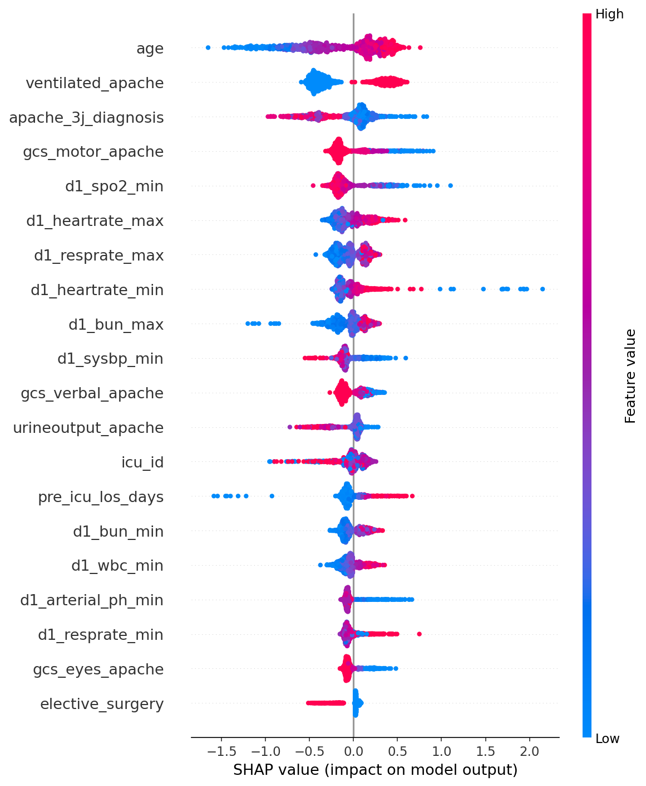

# WiDS Datathon 2020 Mortality Prediction

A machine learning pipeline for predicting in-hospital mortality of ICU patients using clinical data, built with scikit-learn and XGBoost.

## Dataset
[WiDS Datathon 2020](https://www.kaggle.com/competitions/widsdatathon2020) — 91,713 ICU patient records with 186 clinical features including vitals, lab values, demographics, and APACHE severity scores.

## Notebook
[View Notebook Here](https://github.com/Adyan213/ICU-Mortality-Prediction/blob/main/icu-mortality-prediction.ipynb)

## Pipeline
- Dropped 55 features with >70% missing values
- Median imputation for numerical features, mode imputation for categorical
- One-hot encoding for low cardinality categorical features
- Class imbalance handling via scale_pos_weight (1:10 survival:death ratio)
- Removed APACHE pre-computed mortality scores to test raw feature predictiveness

## Models

### Logistic Regression (Baseline)
| Metric | Score |
|---|---|
| AUC-ROC | 0.796 |
| Died Recall | 78% |
| Died Precision | 29% |
| Macro F1 | 0.65 |

### XGBoost (No APACHE Scores)
| Metric | Score |
|---|---|
| AUC-ROC | 0.900 |
| Died Recall | 71% |
| Died Precision | 38% |
| Macro F1 | 0.71 |

## Key Finding
Removing pre-computed APACHE mortality probability scores did not degrade performance — the model achieved equivalent AUC-ROC (0.900) using only raw clinical features. This suggests the model independently learned clinically meaningful mortality patterns from vitals, labs, and patient history.

## SHAP Analysis
SHAP values confirm the model learned clinically coherent patterns:

- Ventilation requirement — strongest predictor, mechanical ventilation indicates severe illness
- Age — older patients have significantly higher mortality risk
- GCS components — low consciousness level strongly associated with mortality
- Day 1 vitals — low SpO2, low blood pressure, high BUN all increase mortality risk
- Elective surgery — strongest protective factor, planned procedures indicate healthier baseline

## Tech Stack
Python, XGBoost, scikit-learn, SHAP, pandas, matplotlib
